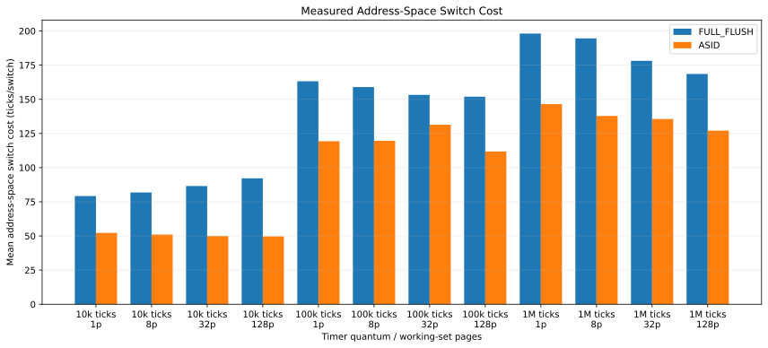
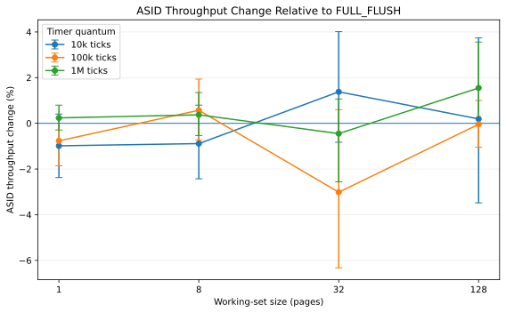
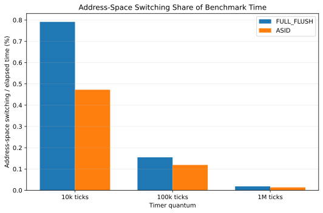

# Evaluating ASID-Based Sv39 Address-Space Switching in Mini-RVOS

## Abstract

This study evaluates the effect of Address Space Identifiers (ASIDs) on
Sv39 address-space switching in Mini-RVOS, a small RISC-V operating
system running on QEMU `virt`.

The baseline `FULL_FLUSH` implementation assigns ASID 0 to every
process and performs two global `SFENCE.VMA` operations around each
measured `satp` address-space switch. The experimental `ASID`
implementation assigns fixed process-specific ASIDs and avoids
per-switch global fences while page tables remain unchanged and ASIDs
are not reused.

The experiment varies timer quantum and private memory working-set size.
Two processes execute a memory workload under three timer quanta and
four working-set sizes. Each of the resulting 24 policy/configuration
conditions is executed 20 times, producing 480 final benchmark runs.

ASID eliminated the measured per-switch global fence operations and
reduced measured address-space switch latency in every experimental
cell. The cellwise reduction ranged from 14.24% to 46.09%, with an
unweighted mean reduction of approximately 29.68%.

This reduction did not produce a resolved improvement in end-to-end
user throughput. Bootstrap 95% confidence intervals for the ASID
throughput change included zero in all 12 matched quantum/working-set
comparisons.

The results show that ASID-based switching makes the measured
address-space activation path cheaper in Mini-RVOS on the tested QEMU
environment, while the resulting cost difference is too small or too
variable to establish an end-to-end throughput gain under the tested
memory workloads.

---

## 1. Research Question

The study addresses the following question:

~~~text
How does ASID-based Sv39 address-space switching affect
preemptive scheduling overhead in Mini-RVOS across different
timer quanta and memory working-set sizes?
~~~

The experiment focuses on three dimensions:

~~~text
address-space switching policy
timer quantum
memory working-set size
~~~

The measured outcomes are:

~~~text
SFENCE.VMA count
address-space switch time
elapsed benchmark time
completed user work
user-work throughput
~~~

The study does not directly measure hardware TLB misses.

---

## 2. Mini-RVOS Context

Mini-RVOS is a small RV64 operating system using Sv39 virtual memory.

The research configuration contains:

~~~text
RISC-V RV64
Sv39 virtual memory
two user processes
preemptive timer scheduling
per-process page tables
private user memory
QEMU virt machine
128 MiB guest RAM
~~~

Each process owns its own page-table root and private physical backing
for the benchmark working set.

The scheduler changes address spaces when switching between the two
processes.

---

## 3. Address-Space Switching Policies

### 3.1 FULL_FLUSH

`FULL_FLUSH` is the baseline switching policy.

All processes use:

~~~text
ASID = 0
~~~

The measured address-space activation path writes the next page-table
root to `satp` and performs two global `SFENCE.VMA` operations.

For 100 measured process switches, the baseline therefore records:

~~~text
sfence_count = 200
~~~

This behavior is a property of the Mini-RVOS baseline implementation
used in the experiment.

### 3.2 ASID

The experimental mode assigns fixed ASIDs:

~~~text
Process 1
ASID = 1

Process 2
ASID = 2
~~~

The ASID value is encoded in the Sv39 `satp` value together with the
page-table root PPN.

During the measured benchmark:

- ASIDs are unique.
- ASIDs are not reused.
- Process page tables are not modified after benchmark execution begins.
- Required page-table construction is completed before the measured run.

Under these invariants, the measured ASID process-switch path changes
`satp` without issuing a global `SFENCE.VMA` on each switch.

The benchmark also probes implemented hardware ASID bits before
entering the measured scheduler.

---

## 4. Experimental Method

### 4.1 Environment

The final dataset was collected with:

~~~text
QEMU:
QEMU emulator version 10.2.1
(Debian 1:10.2.1+ds-1ubuntu3.2)

Machine:
virt

Guest RAM:
128 MiB

Timer frequency:
10,000,000 Hz

Compiler:
riscv64-unknown-elf-gcc
(14.2.0+19) 14.2.0

Virtual memory:
Sv39

Processes:
2

Measured context switches per run:
100
~~~

The final dataset was collected from Mini-RVOS commit:

~~~text
63d1fbb42a371c612d8726bf2e3440b78a1363cb
~~~

The experiment metadata recorded:

~~~text
working_tree_dirty=no
~~~

so the benchmark was executed from a clean source state.

### 4.2 Timer Quanta

Three supervisor-timer quanta were tested:

| Quantum | Approximate interval at 10 MHz |
| ---: | ---: |
| 10,000 ticks | 1 ms |
| 100,000 ticks | 10 ms |
| 1,000,000 ticks | 100 ms |

Every run terminates after 100 measured process switches.

The switch count is therefore fixed across the experiment. A shorter
quantum increases preemption frequency and reduces the amount of user
execution between switches rather than increasing the recorded switch
count within one run.

### 4.3 Memory Working Sets

Four private working-set sizes were tested:

| Pages | Size |
| ---: | ---: |
| 1 | 4 KiB |
| 8 | 32 KiB |
| 32 | 128 KiB |
| 128 | 512 KiB |

Each process receives independently allocated physical pages mapped at
the same benchmark virtual-address range.

The benchmark validates that the two processes do not share the first
physical page of their working sets.

### 4.4 Memory Workload

The final experimental matrix uses the memory benchmark workload.

One memory work unit is one complete sweep across the configured
working set.

During a sweep, the benchmark visits every configured page and performs
a read-modify-write operation on a 64-bit location.

The process-local saved register `s11` stores the completed sweep count.
The existing trap frame preserves this register across timer
preemption.

This design avoids adding a shared progress page or an extra syscall
to the measured workload.

Because one sweep covers the entire configured working set, an
individual work unit at 128 pages contains more memory operations than
an individual work unit at one page.

Absolute work-unit throughput is therefore not compared across
different working-set sizes. Policy comparisons are performed within
the same quantum and working-set condition.

### 4.5 Experimental Matrix

The final matrix is:

~~~text
2 switching policies
x
3 timer quanta
x
4 working-set sizes
=
24 conditions
~~~

Each condition is repeated:

~~~text
20 times
~~~

for a total of:

~~~text
24 x 20 = 480 runs
~~~

The experiment runner randomizes execution order with a fixed seed:

~~~text
20260825
~~~

This prevents one policy or working-set configuration from always
occupying the same temporal position in the complete experiment.

### 4.6 Measurements

Each benchmark run records:

~~~text
elapsed_ticks
context_switches
sfence_count
address_space_switch_ticks_total
address_space_switch_ticks_max
p1_work_units
p2_work_units
total_work_units
~~~

User-work throughput is calculated as:

~~~text
throughput =
    total_work_units
    x timer_frequency
    / elapsed_ticks
~~~

Address-space switching cost per switch is calculated as:

~~~text
address_space_switch_ticks_total
/
context_switches
~~~

The fraction of measured benchmark time spent in address-space
switching is calculated as:

~~~text
address_space_switch_ticks_total
/
elapsed_ticks
x 100
~~~

### 4.7 Statistical Analysis

Each condition contains 20 independent benchmark executions.

The analysis reports:

- mean
- median
- sample standard deviation
- minimum
- maximum
- coefficient of variation

For the primary policy comparison, ASID throughput change is:

~~~text
(
    ASID mean throughput
    /
    FULL_FLUSH mean throughput
    - 1
)
x 100
~~~

An independent bootstrap with 10,000 resamples is used to estimate the
95% confidence interval of this mean-throughput ratio.

The bootstrap uses the fixed seed:

~~~text
20260825
~~~

The experiment was exploratory and no multiple-comparison correction
was applied. No reported throughput confidence interval excludes zero,
so this does not affect the main throughput conclusion.

---

## 5. Benchmark Correctness and Dataset Validation

### 5.1 Supervisor-Timer Race Found During Initial Collection

The first attempt at the full experiment was stopped after an
instruction page fault.

The observed trap included:

~~~text
scause = 0x000000000000000c
sepc   = 0x00000000000b2ee4
stval  = 0x00000000000b2ee4
~~~

Investigation found that the benchmark had enabled supervisor
interrupts before entering user execution.

With the 10,000-tick quantum, a timer could interrupt S-mode benchmark
or scheduler setup. The scheduler could then treat the supervisor trap
frame as the current user-process frame.

The benchmark was corrected by:

- keeping global supervisor interrupt enable clear while benchmark
  kernel code executes,
- enabling timer delivery for lower-privilege execution,
- arming the first benchmark timer after initial address-space
  activation,
- checking the saved `SSTATUS.SPP` value before accepting a timer frame
  as a user-process preemption.

A targeted stress test then executed:

~~~text
50 FULL_FLUSH runs
50 ASID runs
10,000-tick quantum
8-page working set
100 switches per run
~~~

All 100 runs completed without benchmark failures.

The incomplete dataset collected before this correction was marked
invalid and excluded from all analysis.

### 5.2 Final Dataset Integrity

The corrected full experiment completed all 480 runs.

Validation confirmed:

~~~text
480 total rows
24 experimental conditions
20 runs per condition

240 FULL_FLUSH runs
240 ASID runs
~~~

Every final row satisfied:

~~~text
context_switches = 100

FULL_FLUSH:
sfence_count = 200

ASID:
sfence_count = 0

p1_work_units > 0
p2_work_units > 0

total_work_units =
p1_work_units + p2_work_units
~~~

No `[FAIL]` marker was found in the final run logs.

The Git commit recorded in the experiment metadata matched the source
commit used for validation.

---

## 6. Results

### 6.1 Global Fence Count

The most direct difference between the two policies is deterministic in
the tested implementation.

For every final run:

~~~text
FULL_FLUSH
100 switches
200 measured global SFENCE.VMA operations

ASID
100 switches
0 measured per-switch global SFENCE.VMA operations
~~~

The ASID implementation therefore eliminated the measured global
fences performed by the baseline process-switch path.

This result concerns the measured Mini-RVOS path. It is not a
measurement of TLB misses.

### 6.2 Address-Space Switch Cost

ASID reduced mean measured address-space switch ticks in all 12 matched
quantum/working-set cells.

The reduction ranged from:

~~~text
14.24%
to
46.09%
~~~

The unweighted mean of the 12 cellwise reductions is approximately:

~~~text
29.68%
~~~

At the shortest 10,000-tick quantum, switch-cost reductions were:

| Working set | Switch-cost reduction |
| ---: | ---: |
| 1 page | 34.01% |
| 8 pages | 37.65% |
| 32 pages | 42.38% |
| 128 pages | 46.09% |

The monotonic pattern at this quantum was not reproduced at the other
two quanta.

At 100,000 ticks, reductions ranged from 14.24% to 26.89%.

At 1,000,000 ticks, reductions ranged from 23.89% to 29.18%.

The consistent direction across all cells supports the conclusion that
the measured ASID address-space activation path is cheaper than the
FULL_FLUSH path in this environment.

### 6.3 User Throughput

The primary end-to-end result is different from the direct
switch-latency result.

| Quantum | Working set | ASID throughput change | Bootstrap 95% CI |
| ---: | ---: | ---: | ---: |
| 10,000 | 1 | -0.985% | -2.376% to +0.405% |
| 10,000 | 8 | -0.887% | -2.428% to +0.795% |
| 10,000 | 32 | +1.379% | -0.829% to +4.014% |
| 10,000 | 128 | +0.193% | -3.483% to +3.738% |
| 100,000 | 1 | -0.767% | -1.862% to +0.251% |
| 100,000 | 8 | +0.572% | -0.728% to +1.935% |
| 100,000 | 32 | -3.014% | -6.326% to +0.599% |
| 100,000 | 128 | -0.043% | -1.052% to +0.999% |
| 1,000,000 | 1 | +0.238% | -0.291% to +0.795% |
| 1,000,000 | 8 | +0.372% | -0.536% to +1.348% |
| 1,000,000 | 32 | -0.450% | -2.562% to +1.064% |
| 1,000,000 | 128 | +1.548% | -0.006% to +3.557% |

All 12 bootstrap 95% confidence intervals include zero.

The final dataset therefore does not establish an end-to-end
user-throughput improvement from ASID-based switching.

Point estimates range from:

~~~text
-3.014%
to
+1.548%
~~~

and change sign across conditions.

The 1,000,000-tick / 128-page condition has the most positive point
estimate, but its interval still reaches slightly below zero:

~~~text
-0.006% to +3.557%
~~~

It is therefore treated as unresolved rather than as a positive
throughput result.

### 6.4 Switching Time as a Fraction of Benchmark Time

The measured address-space switch path occupies a larger fraction of
total benchmark execution at shorter timer quanta.

At the 10,000-tick quantum, the mean cell values were approximately:

~~~text
FULL_FLUSH:
0.74% to 0.85%

ASID:
0.46% to 0.48%
~~~

At the 100,000-tick quantum:

~~~text
FULL_FLUSH:
0.15% to 0.16%

ASID:
0.11% to 0.13%
~~~

At the 1,000,000-tick quantum:

~~~text
FULL_FLUSH:
0.0168% to 0.0198%

ASID:
0.0127% to 0.0146%
~~~

This result explains why a clear reduction in the direct switching path
can coexist with an unresolved end-to-end throughput difference.

Even at the shortest tested quantum, the instrumented address-space
switching path occupies less than one percent of total benchmark time.

At the longest quantum, the measured fraction is around two hundredths
of one percent or less.

---

## 7. Hypothesis Evaluation

### H1: ASID reduces global fence operations

**Supported.**

FULL_FLUSH recorded 200 measured global fences for every 100-switch
run, while ASID recorded zero measured per-switch global fences.

### H2: Shorter quanta increase the importance of address-space switching

**Partially supported under the final protocol.**

The original research plan described shorter quanta in terms of a
higher context-switch count.

The final benchmark fixes each run at exactly 100 switches, so switch
count itself is not an experimental outcome.

What changes is switch frequency and the amount of user execution
between switches.

The fraction of total measured time spent in address-space switching
was much larger at 10,000 ticks than at 1,000,000 ticks.

The direct overhead result therefore supports the expected
short-quantum effect.

A corresponding end-to-end throughput improvement was not resolved.

### H3: A larger memory working set increases the ASID benefit

**Not supported as a general throughput result.**

At the shortest quantum, the measured switch-cost reduction increased
from 34.01% at one page to 46.09% at 128 pages.

This pattern did not persist across the other quanta.

Throughput changes also showed no consistent monotonic relationship
with working-set size.

The final data therefore does not establish a general
working-set-size effect.

### H4: CPU-heavy workloads show a smaller ASID effect than
memory-heavy workloads

**Not tested in the final experimental matrix.**

CPU benchmark functionality was used during benchmark development and
validation, but the final replicated 480-run experiment contains only
the memory workload.

The original plan also considered a syscall workload. That workload was
not included in the final replicated experiment.

No CPU-versus-memory or syscall-versus-memory performance claim is made.

---

## 8. Discussion

### 8.1 Direct Mechanism and End-to-End Performance Are Different Results

The experiment provides strong evidence for a reduction in the measured
address-space switching path.

The ASID policy:

~~~text
removed measured per-switch global fences
and
reduced measured switch latency
~~~

in every tested cell.

The throughput result does not show the same consistency.

This is compatible with the measured time fractions.

The optimized component represents a small fraction of total benchmark
execution, so a substantial percentage reduction inside that component
can produce a small change in whole-program throughput.

For example, reducing a component that consumes less than one percent
of total execution cannot by itself imply a large whole-program gain.

### 8.2 Short Quanta Make Switching More Relevant

The shortest quantum produced the largest address-space switching share
of total benchmark time.

This behavior follows the benchmark structure: the same 100 switches
occur over a much shorter total interval.

The cost of each switch therefore occupies a larger share of the run.

This supports the use of timer quantum as an important experimental
dimension even though the final throughput effect remains unresolved.

### 8.3 Working-Set Effect Is Inconclusive

The working-set dimension was included to test whether retained
address-translation state would produce a larger observable ASID
advantage as memory footprint increased.

The measured switch-cost data at 10,000 ticks shows a pattern consistent
with this expectation.

The same pattern is absent at the longer quanta and the throughput
results do not show a stable trend.

The current experiment therefore cannot separate a true
working-set-dependent ASID effect from QEMU behavior, timer measurement
variation, or ordinary run-to-run variation.

### 8.4 The Result Does Not Measure TLB Misses

The benchmark does not contain a hardware counter for TLB misses.

The study therefore does not quantify changes in TLB miss counts or
make equivalent microarchitectural performance claims.

The measured evidence is limited to:

~~~text
global fence count
address-space switch timing
elapsed time
completed work
throughput
~~~

ASID behavior may affect cached address translations, but this study
does not directly measure that internal mechanism.

---

## 9. Threats to Validity

### 9.1 QEMU Versus Physical Hardware

The experiment runs on QEMU `virt`.

QEMU's implementation of address translation, instruction execution,
timer delivery, and `SFENCE.VMA` does not reproduce every timing
property of a physical RISC-V processor.

The results should therefore be interpreted as:

~~~text
Mini-RVOS behavior on the tested QEMU environment
~~~

rather than as a universal hardware-performance result.

### 9.2 Host Scheduling and Emulator Noise

QEMU itself runs as a host process.

Host operating-system scheduling and other machine activity may affect
guest progress and short timing measurements.

Twenty repetitions per condition and randomized run order reduce the
risk of interpreting a single run as a stable effect, but they do not
remove host-level variation.

### 9.3 `rdtime` Resolution

Address-space switching is short relative to an entire benchmark run.

`rdtime` measurement resolution and emulator timer behavior therefore
affect switch-level measurements.

For this reason, the study analyzes both direct switch timing and
end-to-end completed user work.

### 9.4 Two-Process Scheduler

Mini-RVOS currently benchmarks two processes.

The ASID values are fixed and there is no ASID reuse during the
experiment.

Larger process populations may introduce:

~~~text
more active address spaces
ASID allocation pressure
ASID reuse
different cache behavior
different scheduling behavior
~~~

which are outside this study.

### 9.5 Immutable Page Tables During Measurement

The measured ASID path assumes no benchmark-time page-table
modification and no ASID reuse.

Real operating systems must perform the appropriate address-translation
fences when mappings change or identifiers are reused.

The experimental ASID policy therefore represents a controlled
steady-state switching case.

### 9.6 Baseline Fence Policy

The Mini-RVOS FULL_FLUSH baseline performs two global fences around its
measured `satp` activation path.

The reported reduction compares ASID with this specific baseline.

A different non-ASID implementation with a different fence strategy
could produce a different quantitative result.

### 9.7 Final Workload Scope

The final replicated experiment contains the memory workload only.

CPU and syscall workloads were considered in the research plan but were
not part of the final 480-run dataset.

The conclusions should not be generalized to those workload classes.

### 9.8 Statistical Power

Each cell contains 20 runs.

The confidence intervals show that throughput variation is large enough
to include zero for every policy comparison.

A larger number of repetitions could narrow those intervals and may be
useful in follow-up work.

The present study reports the uncertainty rather than treating the
point estimates as confirmed effects.

---

## 10. Reproducibility

The benchmark and analysis pipeline is implemented in the repository.

Relevant commands are exposed through the Makefile and scripts.

Experiment execution:

~~~text
python3 scripts/run_experiments.py
~~~

Statistical analysis:

~~~text
python3 scripts/analyze_experiment.py <dataset>
~~~

Figure generation:

~~~text
python3 scripts/plot_experiment.py <dataset>
~~~

The final dataset metadata records:

~~~text
Git commit
Git branch
working-tree state
QEMU version
compiler version
timer frequency
timer quanta
working-set sizes
run count
random seed
~~~

The final raw dataset used for this report was:

~~~text
research-results/asid-memory-20260825-131445/results.csv
~~~

The final dataset itself is kept outside normal Git tracking by the
repository's generated-results policy.

The report figures under `docs/assets/asid-research/` are frozen copies
generated from that accepted dataset.

---

## 11. Conclusion

ASID-based Sv39 address-space switching produced a clear reduction in
the measured cost of process address-space activation in Mini-RVOS.

Across the final 480-run memory experiment:

- ASID eliminated the measured per-switch global `SFENCE.VMA`
  operations used by the FULL_FLUSH baseline.
- ASID reduced measured address-space switch latency in all 12 matched
  experimental cells.
- The reduction ranged from 14.24% to 46.09%.
- The unweighted mean cellwise reduction was approximately 29.68%.
- No matched throughput comparison produced a bootstrap 95% confidence
  interval that excluded zero.

The study therefore separates two findings:

~~~text
ASID clearly reduced the measured switching-path cost.

The experiment did not establish a corresponding
end-to-end user-throughput improvement.
~~~

The result also demonstrates the importance of measuring both an
optimized mechanism and whole-workload behavior.

In this Mini-RVOS/QEMU configuration, address-space switching occupies
a small enough portion of total execution that reducing its direct cost
does not automatically produce a detectable throughput gain.

Future work can extend the study to physical RISC-V hardware, larger
process counts, ASID reuse, dynamic page-table changes, additional
workloads, and direct hardware translation-event counters where
available.
